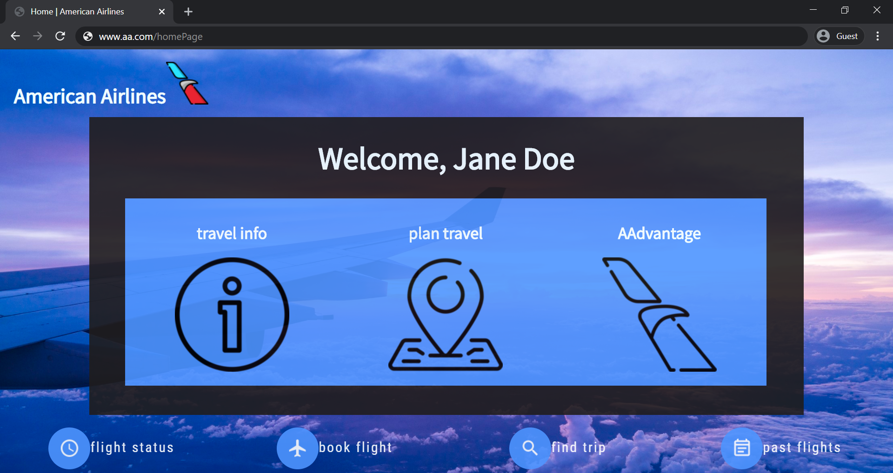
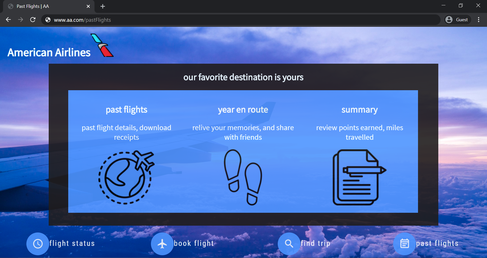
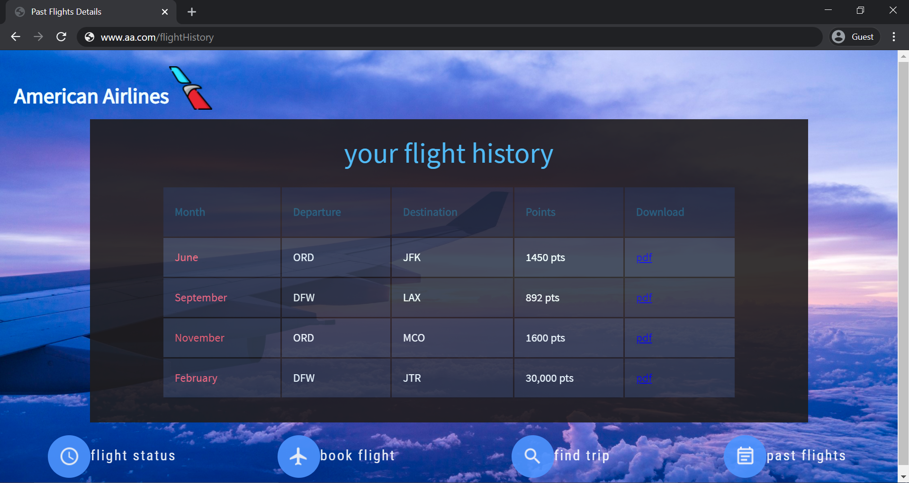
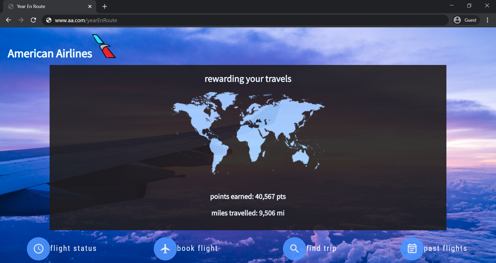

# YearEnRoute ~ A Travel Recap | TAMUHACK2020

Our devpost submission can be found here: https://devpost.com/software/american-airlines-yearenroute-travel-recap

## Our Inspiration
We were inspired by yearly highlights and reels on various social media platforms so we created one for users to be able to see their past flights and relive their memories with American Airlines. We also included features for easy access to the number of points that users have earned from the miles they've traveled. We primarily focused on the visual experience and yearly recap of places visited to reflect the user's travels.  

## What it does
Our web application is designed based on the current American Airlines mobile app with an extra feature of "Past Flights". This feature allows you to be able to see a year worth of flight history, miles, points earned and a video recap of places user's have journeyed to. The video recap starts off with a time-lapse showcasing all the different places and cultures around the world followed by symbolic pictures of the user's traveled to places.

## Challenges we ran into
We ran into challenges with React.js and trying to connect it to what we were trying to accomplish. The API we were given did not have the data for user's flight history and information that we needed. Hence, we shifted to a more UI based approach to mimic our potential design and plan. We also had some issues with scaling the website to different sized screens. Another challenge we ran into was that about a half an hour before the submission our Github branches didn't merge correctly and resulted in lost data and a disarrayed design. We were able to get a previous version working and fix this issue just in time.

## What's next for YearEnRoute | A Travel Recap
We want to be able to use actual user data and populate this to create a wholesome user experience that can be shared on various social media platforms.

## Our Website: Home Page

## Past Flights Feature

## Flight History Details

## Your Travels Summary Page

