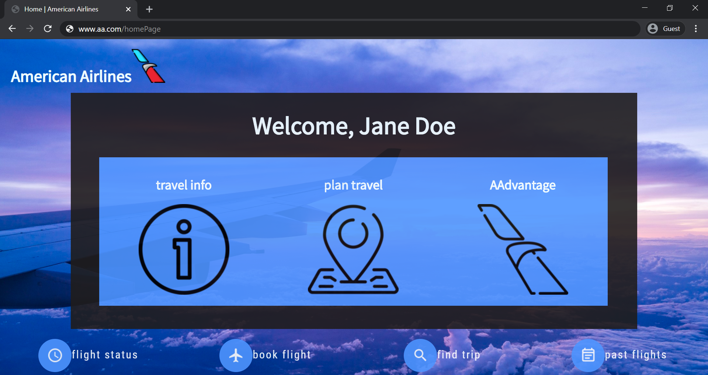
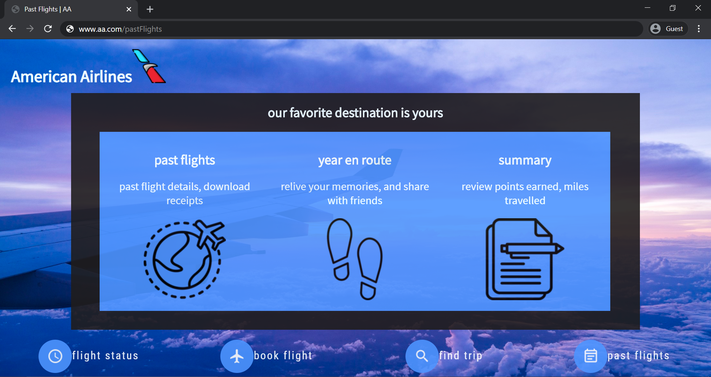
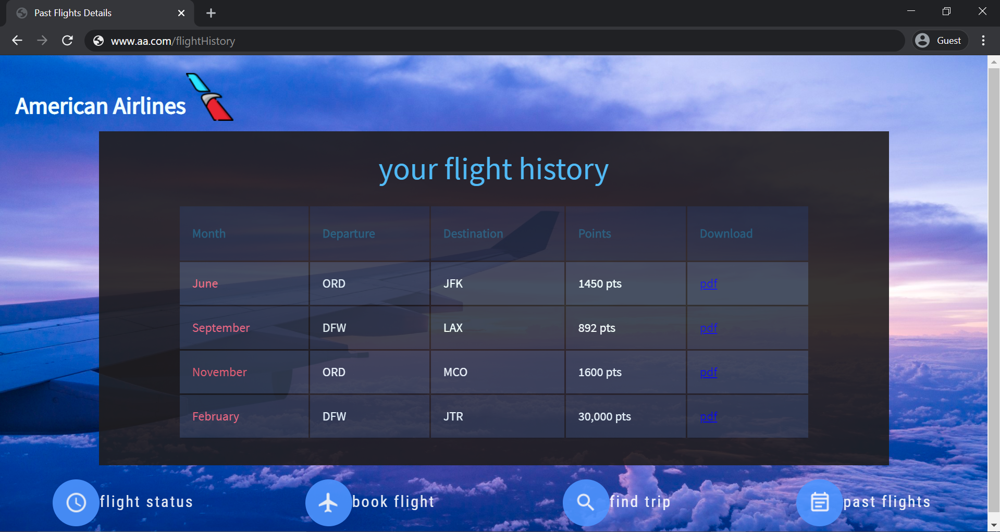
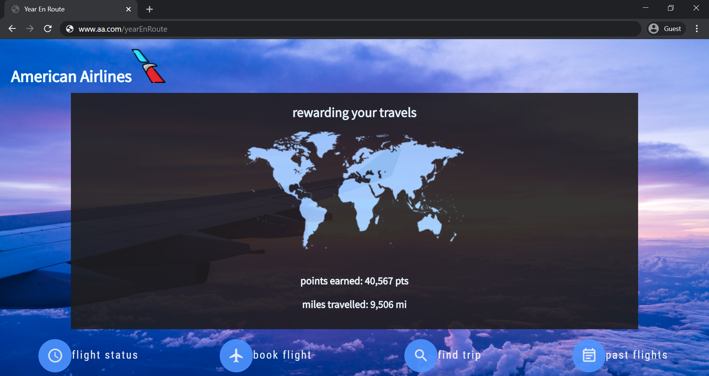

# YearEnRoute | TAMUHACK2020

Our devpost submission can be found [here](https://devpost.com/software/american-airlines-yearenroute-travel-recap)

## Our Inspiration
Inspired by the popular highlight reels and yearly recaps on social media, we created a similar experience for American Airlines users to relive their past flights and memories. Our web app extension focuses on delivering a personalized visual snapshot of the user’s yearly travels; we want to showcase all the places they’ve visited in an easily shareable format to wrap their travel journey.

## What it does
Our web application expands on the current American Airlines mobile app design by introducing the "Past Flights" feature. This allows users to access a year’s worth of flight history, track miles and points earned, and enjoy a video recap of their travels. The video begins with a montage of global destinations and cultural experiences, then transitions into personal photos submitted by the user, showcasing a memorable recap of the places they've visited.

## Challenges we ran into
We encountered a few technical challenges during development, including difficulties with React.js integration and connecting it to our desired outcome. The API we were provided by American Airlines lacked all the necessary user flight history data, so we shifted to a more UI-focused approach to mock our design and plan. We also faced issues with scaling the website across different screen sizes, as well as broader challenges such as ensuring data privacy and security, integrating and synchronizing data from multiple sources, and maintaining scalability to handle a large number of users without compromising performance.

## What's next for YearEnRoute | A Travel Recap
We aim to use real user data to craft a wholesome experience that can be easily shared across various social media platforms. Our goals are to enhance user engagement, promote brand loyalty, increase social sharing, foster community connection, offer personalized recommendations, drive bookings, and incorporate gamification to make the travel journey with American Airlines more memorable and rewarding.

## Our Website: Home Page

## Past Flights Feature

## Flight History Details

## Your Travels Summary Page

